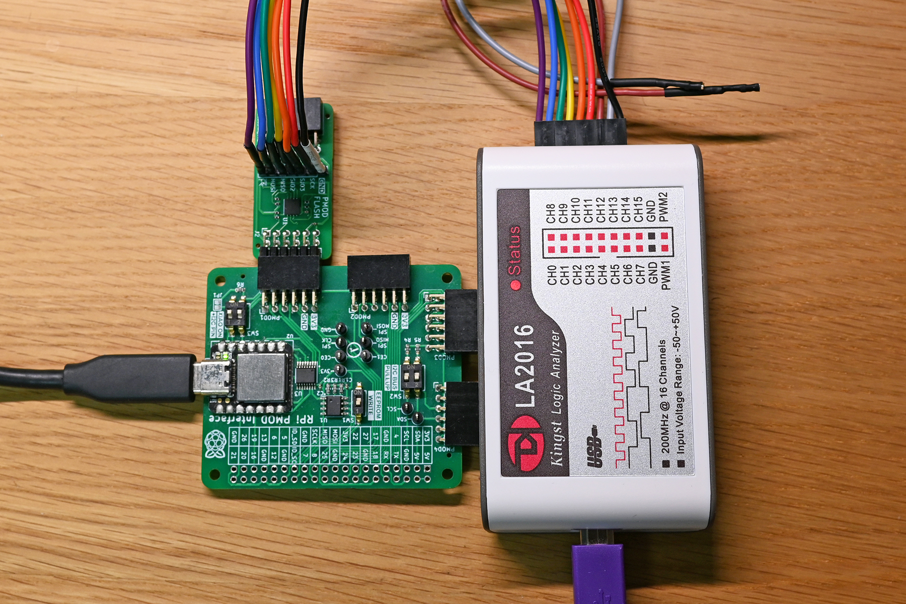

## Flash PMOD - Arduino Test Code

### Setup



The PMOD-Flash module has been successfully tested on a Arduino-class Seeeduino XIAO board. The XIAO uses a Cortex-M0+ SAMD21G18 microcontroller. The original Sparkfun example code has been adopted from the SparkFun_SPI_SerialFlash library with minor changes to enable serial communication and to externalize the SPI clock speed parameter. All credits for the example code go to Sparkfun.

The XIAO is embedded on the [pmod2rpi board](https://github.com/fm4dd/pmod2rpi), and PMOD-Flash was connected to the PMOD1 connector. On the pmod2rpi board, SW3 was in "on" position. This switch toggles the PMOD1 type between I2C and SPI modes, according to Digilents PMOD specification. I used the SPI_Flash_Example.ino sketch example from the Sparkfun library "SparkFun_SPI_SerialFlash". When connecting to the boards PMOD1 connector, the CS signal is connected to XIAO pin-7. For the PMOD2 connector, its XIAO pin-6.

The original sketch misses the serial wait required for the USB connected serial ports. We can add ```while (!Serial) { ; // wait for serial port to connect. Needed for native USB port only}``` right after ```Serial.begin(115200);```


The example program [SPI_Flash_Example](SPI_Flash_Example/) identifies the flash chip vendor and model, can read from the flash, and write the test byte pattern "de ad be ef" into the first 1K memory of the flash.

### SPI Bus Monitoring

 A protocol analyzer was connected directly to the PMOD-Flash analzyer pins to check on SPI clock and protocol information. If a [PMOD-Analyzer board](https://github.com/fm4dd/pmod-analyzer) gets used in between PMOD-flash and pmod2rpi board, the onboard analyzer LEDs must be turned off to let the 10K SPI bus pull-up resistors pull.

Below shows the flash data write to address 0x0, writing the test pattern "de ad be ef".


Below shows the flash data read command for address 0x00.


Note the programs default SPI speed is 2 MHz. The max possible SPI master speed of the Cortex-M0 microcontroller SAMD21G18 is 12 MHz. (https://microchip.my.site.com/s/article/SPI-max-clock-frequency-in-SAMD-SAMR-devices)

### Example Program Serial Output
```
SparkFun SPI SerialFlash Example
SPI Flash detected
Manufacturer: Macronix
Device ID: 0x2817

r)ead HEX values, 1k bytes
v)iew ASCII values, 1k bytes
d)ump raw values, 1k bytes
w)rite test values, 1k bytes
e)rase entire chip
```
Typing 'e':
```
Read raw values for 1024 bytes

0x000: FF FF FF FF FF FF FF FF FF FF FF FF FF FF FF FF
0x010: FF FF FF FF FF FF FF FF FF FF FF FF FF FF FF FF
0x020: FF FF FF FF FF FF FF FF FF FF FF FF FF FF FF FF
0x030: FF FF FF FF FF FF FF FF FF FF FF FF FF FF FF FF
0x040: FF FF FF FF FF FF FF FF FF FF FF FF FF FF FF FF
0x050: FF FF FF FF FF FF FF FF FF FF FF FF FF FF FF FF
0x060: FF FF FF FF FF FF FF FF FF FF FF FF FF FF FF FF
...
0x3C0: FF FF FF FF FF FF FF FF FF FF FF FF FF FF FF FF
0x3D0: FF FF FF FF FF FF FF FF FF FF FF FF FF FF FF FF
0x3E0: FF FF FF FF FF FF FF FF FF FF FF FF FF FF FF FF
0x3F0: FF FF FF FF FF FF FF FF FF FF FF FF FF FF FF FF

r)ead HEX values, 1k bytes
v)iew ASCII values, 1k bytes
d)ump raw values, 1k bytes
w)rite test values, 1k bytes
e)rase entire chip
```
Typing 'v':
```
(returns empty lines, 0xFF does not translate into an ASCII character)

r)ead HEX values, 1k bytes
v)iew ASCII values, 1k bytes
d)ump raw values, 1k bytes
w)rite test values, 1k bytes
e)rase entire chip
```
Typing 'd':
 ```        ...
r)ead HEX values, 1k bytes
v)iew ASCII values, 1k bytes
d)ump raw values, 1k bytes
w)rite test values, 1k bytes
e)rase entire chip
```
Typing 'w':
```
Writing test HEX values to first 1024 bytes

r)ead HEX values, 1k bytes
v)iew ASCII values, 1k bytes
d)ump raw values, 1k bytes
w)rite test values, 1k bytes
e)rase entire chip

Typing 'r':

Read raw values for 1024 bytes

0x000: DE AD BE EF DE AD BE EF DE AD BE EF DE AD BE EF
0x010: DE AD BE EF DE AD BE EF DE AD BE EF DE AD BE EF
0x020: DE AD BE EF DE AD BE EF DE AD BE EF DE AD BE EF
0x030: DE AD BE EF DE AD BE EF DE AD BE EF DE AD BE EF
...
0x3C0: DE AD BE EF DE AD BE EF DE AD BE EF DE AD BE EF
0x3D0: DE AD BE EF DE AD BE EF DE AD BE EF DE AD BE EF
0x3E0: DE AD BE EF DE AD BE EF DE AD BE EF DE AD BE EF
0x3F0: DE AD BE EF DE AD BE EF DE AD BE EF DE AD BE EF

r)ead HEX values, 1k bytes
v)iew ASCII values, 1k bytes
d)ump raw values, 1k bytes
w)rite test values, 1k bytes
e)rase entire chip
```
Typing 'e':
```
Erasing entire chip

r)ead HEX values, 1k bytes
v)iew ASCII values, 1k bytes
d)ump raw values, 1k bytes
w)rite test values, 1k bytes
e)rase entire chip
```
Typing 'r':
```
Read raw values for 1024 bytes

0x000: FF FF FF FF FF FF FF FF FF FF FF FF FF FF FF FF
0x010: FF FF FF FF FF FF FF FF FF FF FF FF FF FF FF FF
0x020: FF FF FF FF FF FF FF FF FF FF FF FF FF FF FF FF
0x030: FF FF FF FF FF FF FF FF FF FF FF FF FF FF FF FF
...
0x3C0: FF FF FF FF FF FF FF FF FF FF FF FF FF FF FF FF
0x3D0: FF FF FF FF FF FF FF FF FF FF FF FF FF FF FF FF
0x3E0: FF FF FF FF FF FF FF FF FF FF FF FF FF FF FF FF
0x3F0: FF FF FF FF FF FF FF FF FF FF FF FF FF FF FF FF
```


