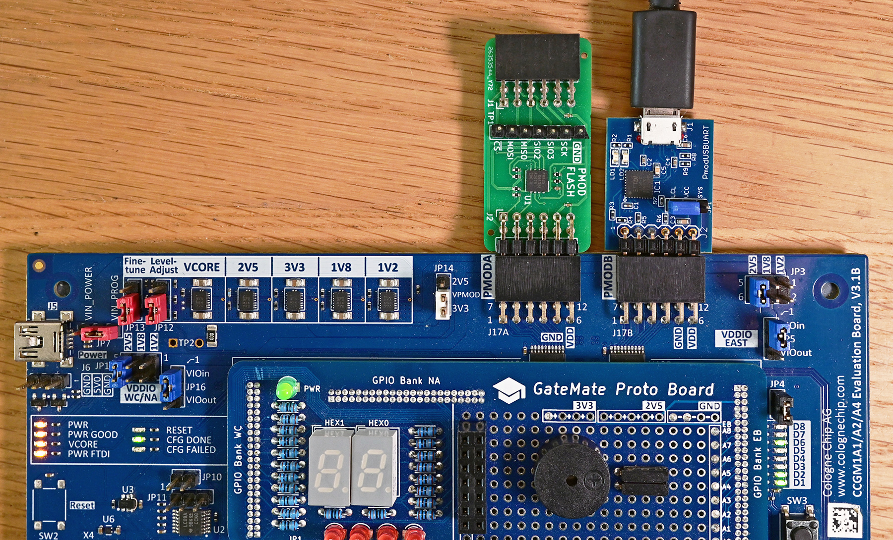

## PMOD-FLASH test program

### Description

This is a Verilog test program for the flash chip on PMOD Flash.
It only sends one command 9Fh (Read Identification - RDID), and returns the output to a serial console.

For my test, I connected PMOD Flash to PMODA on the Gatemate E1 FPGA board.
On PMOD2 I have the Digilent pmod USBUART connected to the lower pinrow.

The SPI clock is a simple 4:1 divider, creating a SPI flash clock frequency of 2.5 MHz (10Mhz/4).

Gatemate constraints:
```
## #######################################################
## PMOD-A constraints for github.com/fm4dd/pmod-flash 
## MX25R6435F is a 64Mbit (8MByte) Serial NOR Flash 
## #######################################################
Pin_out "SPIFLASH_CLK"   Loc = "IO_NB_A3";
Pin_out "SPIFLASH_CS_N"  Loc = "IO_NB_A0";
Pin_out "SPIFLASH_MOSI"  Loc = "IO_NB_A1"; # DQ0/MOSI
Pin_in  "SPIFLASH_MISO"  Loc = "IO_NB_A2"; # DQ1/MISO
## #######################################################
## PMOD-B connector constraints for Digilent PMOD USBUART.
## This single-row PMOD is connected to lower (Bx) pin row
## #######################################################
## Lower Row connection  assignment
Pin_out "CTS" Loc = "IO_NB_B4"; # RTS
Pin_out "TXD" Loc = "IO_NB_B5"; # RXD
Pin_in  "RXD" Loc = "IO_NB_B6"; # TXD
Pin_out "RTS" Loc = "IO_NB_B7"; # CTS
```

PMOD Flash module test on Cologne Chip Gatemate FPGA:



### Build FPGA Bitstream

```
$ make
/home/fm/oss-cad-suite/bin/yosys -ql log/synth.log -p 'read -sv src/spi_id_test.v src/emmitter_uart.v; synth_gatemate -top spi_id_test -luttree -nomx8 -vlog net/spi_id_test_synth.v; write_json net/spi_id_test_synth.json'
test -e src/gatemate-e1.ccf || exit
/home/fm/oss-cad-suite/bin/nextpnr-himbaechel --device=CCGM1A1 --json net/spi_id_test_synth.json --write net/spi_id_test_impl.v -o out=net/spi_id_test_impl.txt -o ccf=src/gatemate-e1.ccf --router router2 > log/impl.log
Info: Using uarch 'gatemate' for device 'CCGM1A1'
Info: Using timing mode 'WORST'
Info: Using operation mode 'SPEED'
...
Info: Device utilisation:
Info: 	            USR_RSTN:       0/      1     0%
Info: 	            CPE_COMP:       0/  20480     0%
Info: 	         CPE_CPLINES:      10/  20480     0%
Info: 	               IOSEL:      15/    162     9%
Info: 	                GPIO:      15/    162     9%
Info: 	               CLKIN:       1/      1   100%
Info: 	              GLBOUT:       1/      1   100%
Info: 	                 PLL:       0/      4     0%
Info: 	            CFG_CTRL:       0/      1     0%
Info: 	              SERDES:       0/      1     0%
Info: 	              CPE_LT:     364/  40960     0%
Info: 	              CPE_FF:     100/  40960     0%
Info: 	           CPE_RAMIO:      10/  40960     0%
Info: 	            RAM_HALF:       0/     64     0%
...
Info: Program finished normally.
/home/fm/oss-cad-suite/bin/gmpack --input net/spi_id_test_impl.txt --bit spi_id_test.bit
```

### Board Programming
```
$ make prog
Programming E1 SPI Config:
/home/fm/oss-cad-suite/bin/openFPGALoader  -b gatemate_evb_spi spi_id_test.bit
empty
Jtag frequency : requested 6.00MHz    -> real 6.00MHz   
JEDEC ID: 0xc22817
Detected: Macronix MX25R6435F 128 sectors size: 64Mb
00000000 00000000 00000000 00
start addr: 00000000, end_addr: 00010000
Erasing: [==================================================] 100.00%
Done
Writing: [==================================================] 100.00%
Done
Wait for CFG_DONE DONE
```
### Output
With the UART assigned to the E1 boards PMODB connector pins, we can display the serial data in a terminal window.

```
$ ./terminal.sh 
picocom v3.1

port is        : /dev/ttyUSB2
flowcontrol    : none
baudrate is    : 1000000
parity is      : none
databits are   : 8
stopbits are   : 1
escape is      : C-a
local echo is  : no
noinit is      : no
noreset is     : no
hangup is      : no
nolock is      : no
send_cmd is    : sz -vv
receive_cmd is : rz -vv -E
imap is        : 
omap is        : 
emap is        : crcrlf,delbs,
logfile is     : none
initstring     : none
exit_after is  : not set
exit is        : no

Type [C-a] [C-h] to see available commands
Terminal ready
Chip ID: C2 28 17 
Chip ID: C2 28 17 
Chip ID: C2 28 17 

Terminating...
Thanks for using picocom
```
Exit picocom with CTL-A followed by CTL-X.

Notice the device identification ID is "C2 28 17" = Macronix MX25R6435F.

* Manufacturer C2 = Macronix
* memory type: 28 = 3V (3.3V) Serial NOR Flash
* mem density: 17 = 64Mbit (8 Megabytes)
