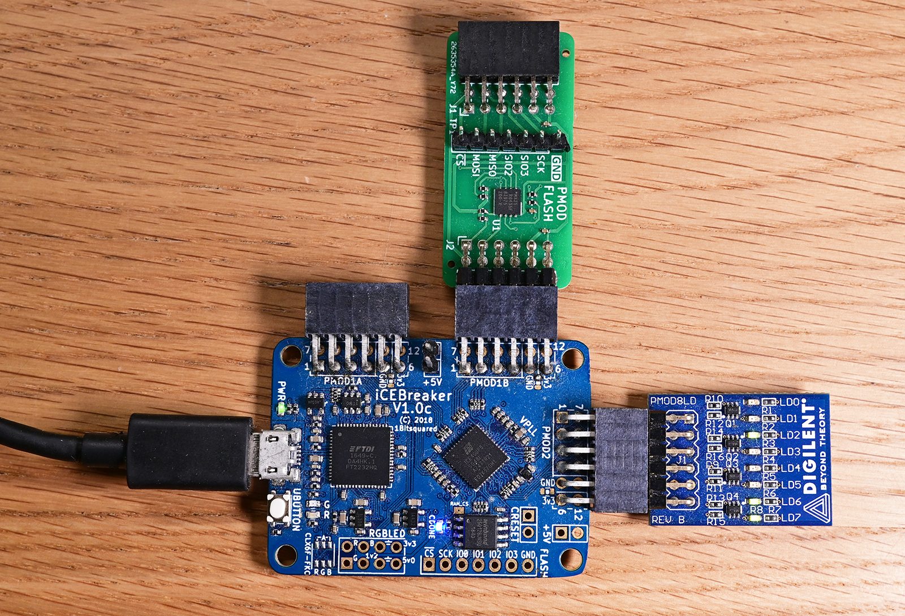

## PMOD-FLASH test program

### Description

This is a Verilog test program for the flash chip on PMOD Flash.
It only sends one command 9Fh (Read Identification - RDID), and returns the output to a serial console.

For my test, I connected PMOD Flash to PMOD1B on the iCEBreaker FPGA board.
On PMOD2 I connected the Digilent pmod 8LD to get the 8-LED diagnostics output.

iCEBreaker constraints:
```
## ##################################################
## iCEBreaker board constraints
## ##################################################
set_io -nowarn CLK        35 # 12 MHz clock
set_io -nowarn RXD         6
set_io -nowarn TXD         9
set_io -nowarn RESET      10

## ##################################################
## PMOD1B constraints for github.com/fm4dd/pmod-flash
# MX25R6435F is a 64Mbit (8MByte) Serial NOR Flash
## ##################################################
set_io -nowarn SPIFLASH_CS_N 43
set_io -nowarn SPIFLASH_MOSI 38
set_io -nowarn SPIFLASH_MISO 34
set_io -nowarn SPIFLASH_CLK  31

## ##################################################
## PMOD2 connector constraints for Digilent PMOD 8LD
## ##################################################
set_io -nowarn LEDS[7]     27
set_io -nowarn LEDS[6]     25
set_io -nowarn LEDS[5]     21
set_io -nowarn LEDS[4]     19
set_io -nowarn LEDS[3]     26
set_io -nowarn LEDS[2]     23
set_io -nowarn LEDS[1]     20
set_io -nowarn LEDS[0]     18
```

PMOD Flash module test on iCEBreaker FPGA:



### Build FPGA Bitstream

```
$ make clean; make
rm -f spi_id_test.json spi_id_test.asc spi_id_test.rpt spi_id_test.bin spi_id_test.vcd spi_id_test.tb abc.history spi_id_test.tb
/home/fm/oss-cad-suite/bin/yosys -p 'synth_ice40 -top spi_id_test -json spi_id_test.json' src/spi_id_test.v src/emitter_uart.v

 /----------------------------------------------------------------------------\
 |  yosys -- Yosys Open SYnthesis Suite                                       |
 |  Copyright (C) 2012 - 2026  Claire Xenia Wolf <claire@yosyshq.com>         |
 |  Distributed under an ISC-like license, type "license" to see terms        |
 \----------------------------------------------------------------------------/
 Yosys 0.62+55 (git sha1 29a270c4b, clang++ 18.1.8 -fPIC -O3)
...
=== spi_id_test ===

        +----------Local Count, excluding submodules.
        | 
      231 wires
      438 wire bits
      231 public wires
      438 public wire bits
        8 ports
       15 port bits
        1 cells
        1   $scopeinfo
      328 submodules
       42   SB_CARRY
        1   SB_DFF
       39   SB_DFFE
       21   SB_DFFESR
        8   SB_DFFESS
       26   SB_DFFSR
        5   SB_DFFSS
      186   SB_LUT4
...
Info: Program finished normally.
/home/fm/oss-cad-suite/bin/icetime -d up5k -mtr spi_id_test.rpt spi_id_test.asc
// Reading input .asc file..
// Reading 5k chipdb file..
// Creating timing netlist..
// Timing estimate: 20.52 ns (48.73 MHz)
/home/fm/oss-cad-suite/bin/icepack spi_id_test.asc spi_id_test.bin
```

### Board Programming
```
$ make prog
Programming to Flash:
/home/fm/oss-cad-suite/bin/iceprog spi_id_test.bin
init..
cdone: high
reset..
cdone: low
flash ID: 0xEF 0x40 0x18 0x00
file size: 104090
erase 64kB sector at 0x000000..
erase 64kB sector at 0x010000..
programming..
done.                 
reading..
VERIFY OK             
cdone: high
Bye.
```
### Output
On iCEBreaker we get to onboard UART typically as device /dev/ttyUSB1, we can display the serial data in a terminal window.

```
$ ./terminal.sh 
picocom v3.1

port is        : /dev/ttyUSB1
flowcontrol    : none
baudrate is    : 1000000
parity is      : none
databits are   : 8
stopbits are   : 1
escape is      : C-a
local echo is  : no
noinit is      : no
noreset is     : no
hangup is      : no
nolock is      : no
send_cmd is    : sz -vv
receive_cmd is : rz -vv -E
imap is        : 
omap is        : 
emap is        : crcrlf,delbs,
logfile is     : none
initstring     : none
exit_after is  : not set
exit is        : no

Type [C-a] [C-h] to see available commands
Terminal ready
Chip ID: C2 28 17 
Chip ID: C2 28 17 
Chip ID: C2 28 17 

Terminating...
Thanks for using picocom
```
Exit picocom with CTL-A followed by CTL-X.

Notice the device identification ID is "C2 28 17" = Macronix MX25R6435F.

* Manufacturer C2 = Macronix
* memory type: 28 = 3V (3.3V) Serial NOR Flash
* mem density: 17 = 64Mbit (8 Megabytes)

If the module constraints are wrong and the SPI communication fails, the typical serial output becomes "FF FF FF".
