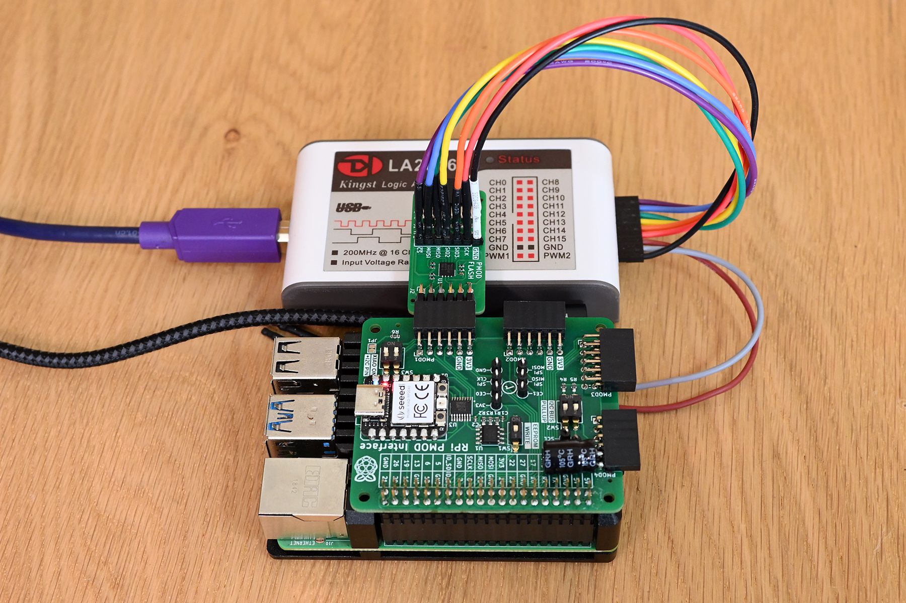
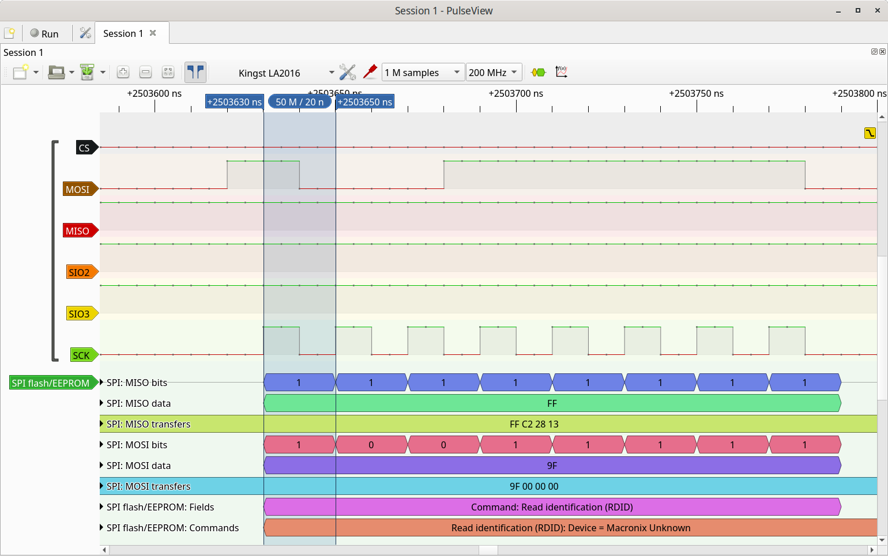

## Flash PMOD - Raspberry Pi Test Code

### Setup



The PMOD-Flash module has been successfully tested on a Raspberry Pi 4 running Raspberry OS version 11. There, the PMOD-FLash module was connected through the [pmod2rpi board](https://github.com/fm4dd/pmod2rpi). The pmod2rpi board is interfacing with the Raspberry Pi's SPI bus that is exposed on the GPIO pinheader per below connection schematic:


### Function Test

The Raspberry Pi OS comes with the *flashrom* program that can be used to read or write to the flash module.


The example program [SPI_Flash_Example](SPI_Flash_Example/) identifies the flash chip vendor and model, and we can dump the entire content from the flash into a local file *rom.img*. The completion time strongly relates to the SPI bus speed setting (given in KHz). In the example below we set 22 MHz for the SPI bus.


After the flash read completes, we can view the flash content from file.


### SPI Bus Monitoring

 A protocol analyzer was connected directly to the PMOD-Flash analzyer pins to check on SPI clock and protocol information. If a [PMOD-Analyzer board](https://github.com/fm4dd/pmod-analyzer) gets used in between PMOD-flash and pmod2rpi board, the onboard analyzer LEDs must be turned off to let the 10K SPI bus pull-up resistors pull.

Below shows the flash *read identification* command RDID, executed with 50MHz (20 nanoseconds clock period). This is reaching the limit for the attached protocol analyzer, which has a maximum sample rate of 200 MHz. The waveform dots representing the samples show we are down to only two samples for each logic level of the SPI clock *SCK*.



On a Raspberry Pi, the SPI clock is reported to run up to 125MHz max (when running at full core clock speed of 250 MHz).


### Flashrom commands reference

#### Write image to flash

Create a dummy 8M ROM image to write to the flash:
```
pi@gekko:~ $ dd if=/dev/urandom of=flash_8M.img bs=8388608 count=1 conv=notrunc,fsync
1+0 records in
1+0 records out
8388608 bytes (8.4 MB, 8.0 MiB) copied, 0.349986 s, 24.0 MB/s
```

Instead of ```if=/dev/urandom``` we could use ```if=/dev/zero``` to create a image with 0x00.

Write the random data image to flash:

```
pi@gekko:~ $ sudo flashrom -p linux_spi:dev=/dev/spidev0.0,spispeed=22000 -w flash_8M.img
flashrom v1.2 on Linux 6.1.21-v8+ (aarch64)
flashrom is free software, get the source code at https://flashrom.org

Using clock_gettime for delay loops (clk_id: 1, resolution: 1ns).
Found Macronix flash chip "MX25R6435F" (8192 kB, SPI) on linux_spi.
Reading old flash chip contents... done.
Erasing and writing flash chip... Erase/write done.
Verifying flash... VERIFIED.
```

## Erase the flash

When the flash is erased, it flips every bit to 1 (0xFF content):

```
pi@gekko:~ $ sudo flashrom -p linux_spi:dev=/dev/spidev0.0,spispeed=22000 -E
flashrom v1.2 on Linux 6.1.21-v8+ (aarch64)
flashrom is free software, get the source code at https://flashrom.org

Using clock_gettime for delay loops (clk_id: 1, resolution: 1ns).
Found Macronix flash chip "MX25R6435F" (8192 kB, SPI) on linux_spi.
Erasing and writing flash chip... Erase/write done.
```

## Operations on specific Flash Memory Locations

In order to read or write only partial data to flash, we can select the flash region. The *flashrom* program can read the specific memory location from a layout file. The layout file contains lines for "startaddr:endaddr imagename". The *flashrom* manual has more information.
