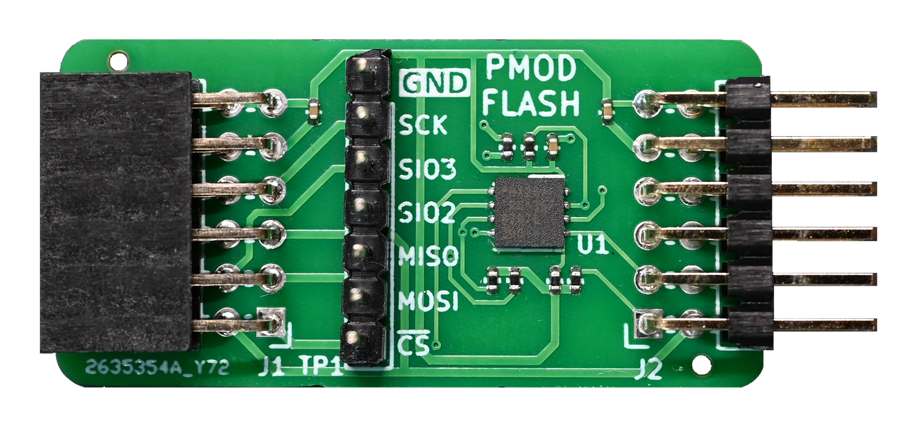
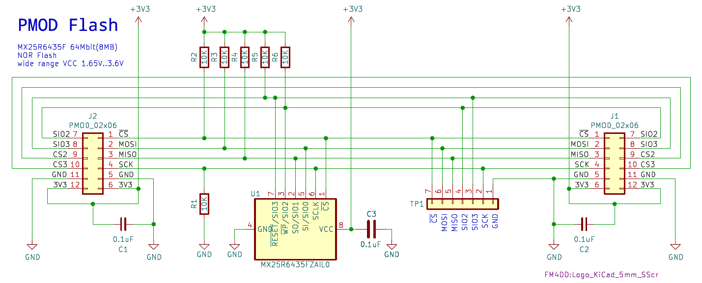
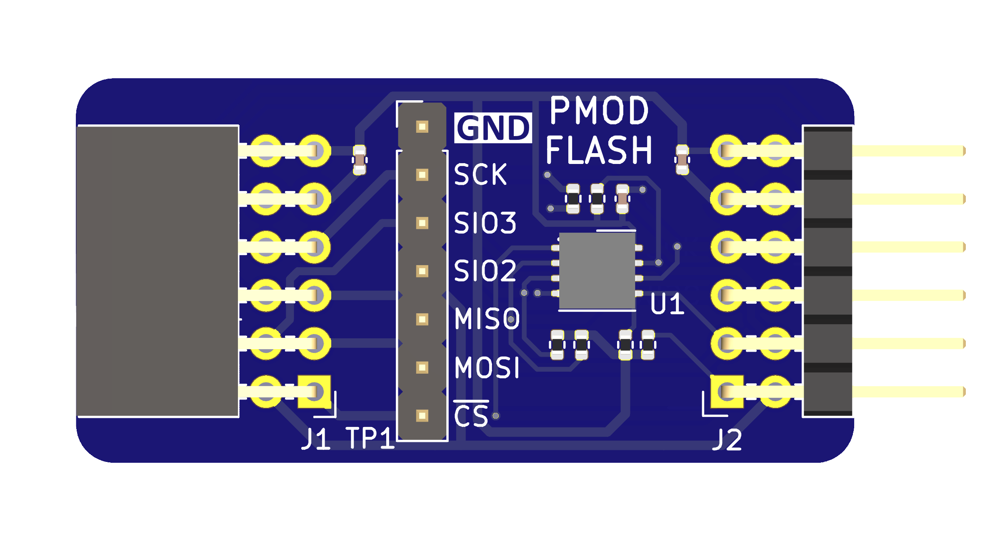
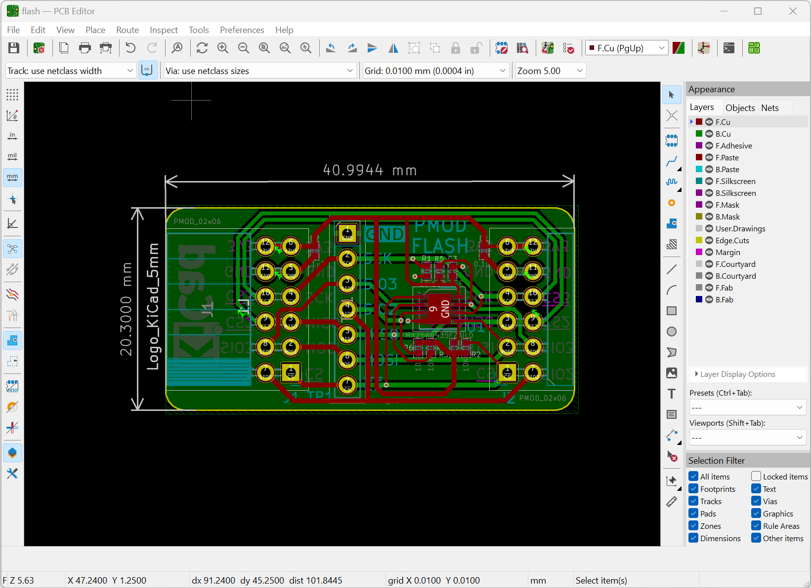
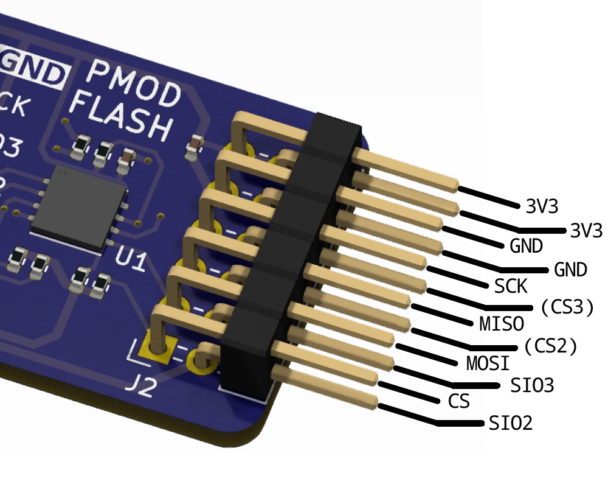
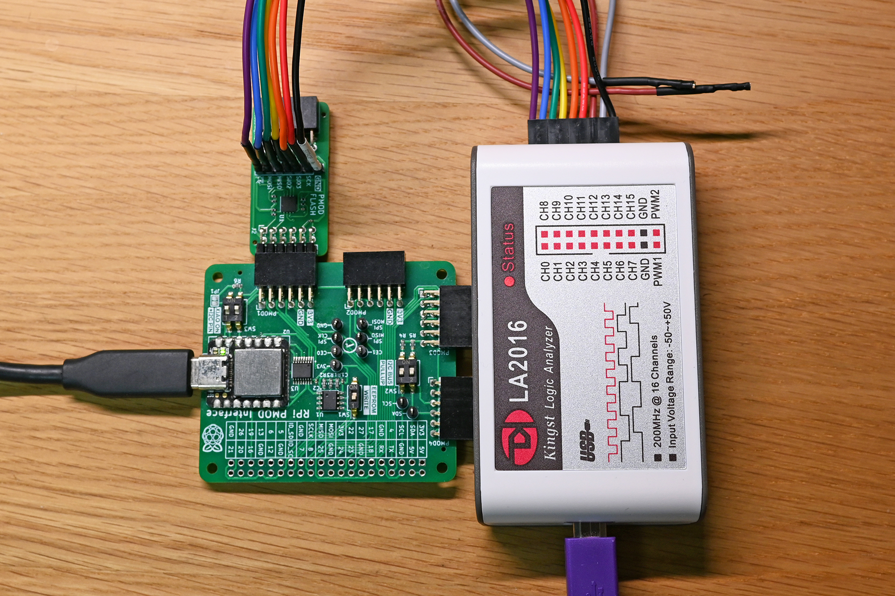
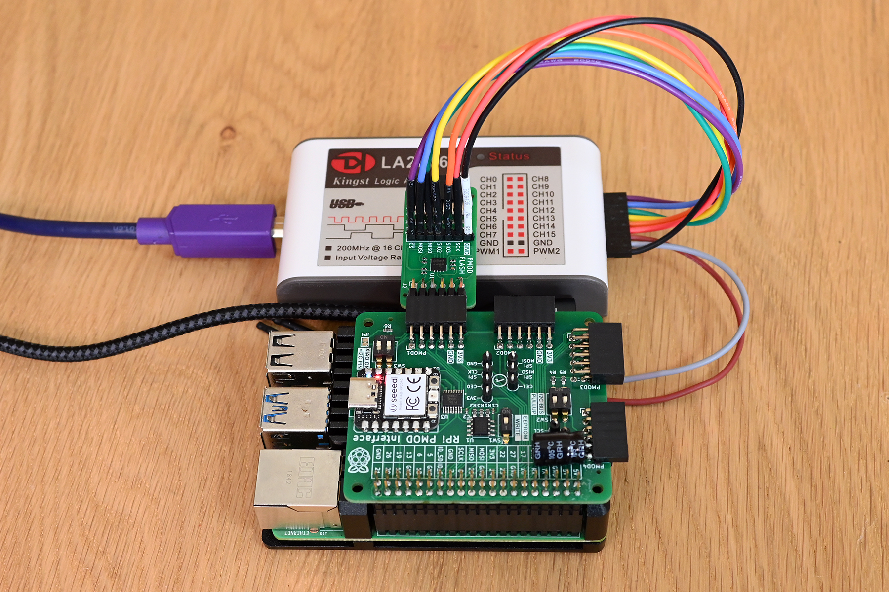
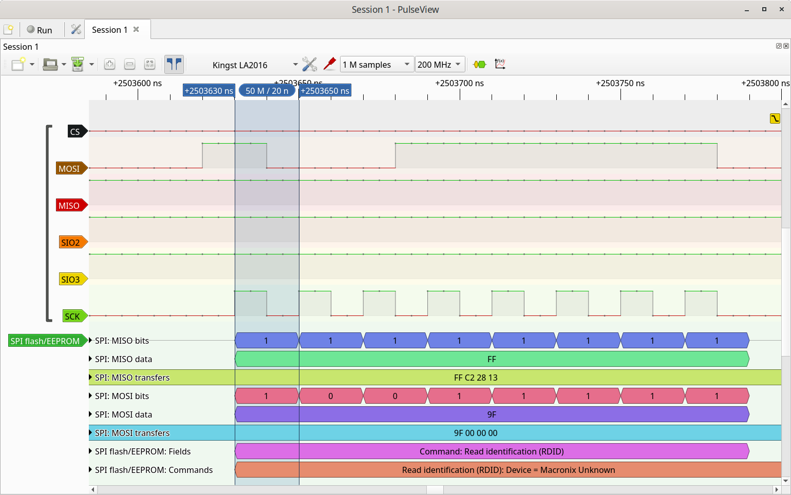

## Flash PMOD

### Description

This PMOD provides the Macronix MX25R6435F SPI Flash memory in a pass-through PMOD connector board. The MX25R6435F is a	64Mbit (8MByte) Serial NOR Flash that can operate in multiple modes up to 80Mhz Quad SPI. The PMOD includes the option to install a 7-pin 2.54mm pitch testpoint header for signal and protocol analysis.

https://www.mxic.com.tw/en-us/products/NOR-Flash/Pages/Ultra-Low-Power-Flash.aspx

http://fpga.fm4dd.com/

### Schematic

### PCB Gerber

[PMOD Flash Gerber V1.0](fabfiles/v10/20230921-pmod-flash-gerber.zip)

The PMOD Flash module was designed with KiCad 7

### Pin Assignments
<table>
  <tr><th>Pinout</th><th>Pin</th><th>Function</th><th>Pin</th><th>Function</th></tr>
  <tr><td rowspan="6"></td>
        <td>1</td><td>CS</td><td>7</td><td>SIO2</td></tr>
    <tr><td>2</td><td>MOSI</td><td>8</td><td>SIO3</td></tr>
    <tr><td>3</td><td>MISO</td><td>9</td><td> not connected (CS2)</td></tr>
    <tr><td>4</td><td>SCK</td><td>10</td><td>not connected (CS3)</td></tr>
    <tr><td>5</td><td>GND</td><td>11</td><td>GND</td></tr>
    <tr><td>6</td><td>3V3</td><td>12</td><td>3V3</td></tr>
</table>

### Example Code

The following Verilog code examples demonstrate the board function for quick verification.

| Platform | Test Program location                | Description                                                  |
|----------|--------------------------------------|--------------------------------------------------------------|
| Arduino  |[examples/arduino](examples/arduino)  | Flash test adopted from the SparkFun_SPI_SerialFlash library |
| Raspberry|[examples/rpi](examples/rpi)          | Linux has the flashrom program for basic read/write commands |

### PMOD-Flash Function Tests

PMOD Flash module connected to the PMOD2RPi board, driven by Seeeduino XIAO SAMD21 MCU:

PMOD Flash module connected to the PMOD2RPi board, interfacing with the Raspberry Pi 4:

PMOD Flash module verified running at 50MHz SPI clock speed with the Raspberry Pi 4:

